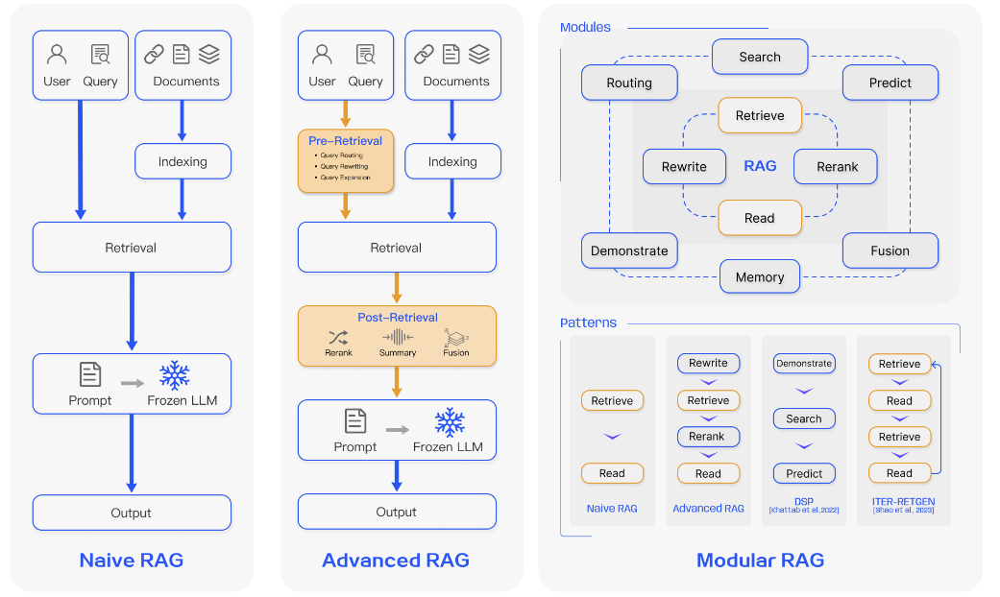
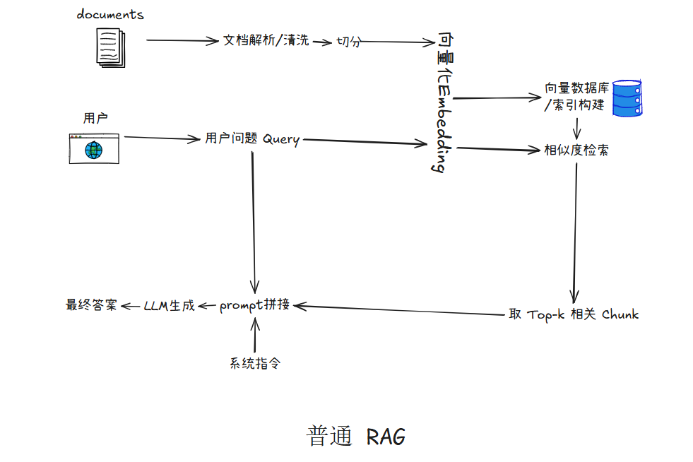

任务:梳理RAG基础原理系统，彻底搞懂RAG全链路，分清普通RAG→进阶RAG的区别. 可以先读点文献，然后拆解RAG完整链路。能做到画出RAG完整流程图，口述每一步的作用、常见的痛点、优化方向。
## 一、知识库构建模块

### 1. 文档解析 / 清洗
| 检索源类型   | 定义                              | 典型数据格式                       | 痛点                              |
| ------- | ------------------------------- | ---------------------------- | ------------------------------- |
| 非结构化数据  | 以自然语言文本为主、没有固定结构的数据，是最常见的RAG检索源 | Wikipedia、网页、新闻、论文、法律/医疗文本   | 噪声多；语义边界不清；长文档切块后容易丢失上下文        |
| 半结构化数据  | 同时包含文本和一定结构信息的数据                | PDF、HTML、Markdown、表格         | 表格或版面结构容易在切块时被破坏；普通向量检索难以理解行列关系 |
| 结构化数据   | 具有明确模式和关系的数据，通常可表达实体间逻辑关系       | 知识图谱、数据库、三元组、实体关系网络          | 构建和维护成本高；需要实体识别、关系抽取和一致性校验      |
| LLM生成内容 | 由大语言模型根据问题或上下文生成的辅助知识           | 假设文档、生成答案、模型记忆、伪上下文          | 可能产生幻觉；真实性难验证；容易引入错误知识          |
| 多源异构数据  | 同时融合多种检索源的数据体系                  | 文本 + 表格 + KG + 数据库 + LLM生成内容 | 数据格式不统一；检索结果难融合；不同来源可信度不同       |

### 2. 结构化分块
作用:分chunk

| 分块方式     | 含义             | 优点       | 缺点     |
| -------- | -------------- | -------- | ------ |
| 固定长度分块   | 按 token 数硬切    | 简单       | 容易切断语义 |
| 滑动窗口分块   | 每块之间保留 overlap | 减少上下文断裂  | 冗余增加   |
| 按标题/段落分块 | 根据文档结构切        | 语义完整     | 依赖文档格式 |
| 语义分块     | 根据语义相似度切       | 更自然      | 实现复杂   |
| 代码结构分块   | 按文件、类、函数、基本块切  | 适合代码 RAG | 需要解析器  |
| 图结构分块    | 按实体、关系、调用链切    | 适合复杂推理   | 构建成本高  |
**chunk 不是越小越好，也不是越大越好。**
chunk 太小，容易丢上下文；chunk 太大，检索命中不精确，而且会浪费上下文窗口。
机械分块切断语义
##### 优化方向
让 chunk 边界符合文档真实语义结构
语义分块：通过embedding相似度实现语义发生变化时再切块
表格单独chunk
父子分块:小chunk用于检索，大chunk用于生成
动态 overlap
通过树结构实现层次分块多条检索，比如GraphRAG
LLM-based Chunking，但又贵又慢又不稳定，所以经常“规则 + embedding”

### 3. Metadata 构建

| 作用   | 给每个 chunk 添加来源、页码、章节、时间、类型、标签等附加信息                                                           |
| ---- | -------------------------------------------------------------------------------------------- |
#### 优化方向
给Metadata添加语义标签，抽取实体，添加关系

### 4. Embedding 向量化
作用:把文本映射成向量空间中的语义表示
Embedding质量≈检索质量下限,因为Retriever 第一阶段本质就是 embedding matching。

> Embedding 适合捕捉语义相似性，但不一定适合精确匹配专业符号，所以进阶 RAG 通常不会只依赖向量检索。

#### 痛点
| 矛盾          | 含义           |
| ----------- | ------------ |
| 压缩 vs 信息保留  | 向量有限         |
| 泛化 vs 专业性   | 通用模型不懂领域     |
| 语义 vs 关键词   | Dense容易忽略关键字 |
| 长文本 vs 表达能力 | 长文本语义塌缩      |
| 精度 vs 速度    | 多向量更准但更慢     |
#### 优化方向
从通用 embedding走向任务专用 embedding，Embedding 微调优化
Long Context / Multi-Vector Embedding，解决长文本语义压缩损失
将标题、章节、时间等元数据融入向量
### 5. 索引构建

| 作用  | 把已经处理好的知识片段组织成一种“可以被快速、准确检索”的数据结构，使用户提问时系统能从大量文档中迅速找到相关内容 |
| --- | --------------------------------------------------------- |

| 类型   | 代表方法             | 特点               |
| ---- | ---------------- | ---------------- |
| 稀疏检索 | BM25、TF-IDF      | 依赖关键词匹配，适合精确术语   |
| 稠密检索 | DPR、Embedding 检索 | 依赖语义相似度，适合自然语言问题 |
| 混合检索 | BM25 + 向量检索      | 兼顾关键词和语义         |
#### 痛点与优化方向
##### 1. 检索速度慢

| 痛点                   | 优化方向                         |
| -------------------- | ---------------------------- |
| chunk 数量大，逐个计算相似度成本高 | 使用 ANN 近似最近邻索引，如 HNSW、IVF、PQ |
| 向量维度高，计算开销大          | 向量压缩、降维、量化                   |
| 数据规模增长后延迟变高          | 分片索引、分布式向量数据库                |

---

##### 2. 检索精度不足

| 痛点                       | 优化方向                       |
| ------------------------ | -------------------------- |
| ANN 是近似搜索，可能漏掉真正相关 chunk | 提高候选召回数量、后接 rerank         |
| 只用向量索引，关键词匹配弱            | 构建混合索引：Dense Vector + BM25 |
| 专业术语、代码、公式匹配不稳定          | 引入关键词索引、实体索引、领域词典索引        |

---

##### 3. 索引结构单一

|痛点|优化方向|
|---|---|
|普通向量库只支持“相似 chunk 检索”|构建多级索引：文档级、章节级、chunk级|
|难以支持多跳推理|构建图索引，如实体图、chunk 图、知识图谱|
|难以处理长文档|构建层次索引：Document → Section → Chunk|

---


##### 4. 多模态内容难索引

|痛点|优化方向|
|---|---|
|表格、图片、公式无法直接进入普通文本向量库|为表格、图片、公式建立独立索引|
|表格结构被展平成文本后信息丢失|表格索引保留 schema、行列关系、标题|
|图片信息无法被文本检索|OCR + caption + 多模态 embedding|


# 二、Query 增强模块

## 1. Query 理解 / 改写
优化方向:
保留原 query + 改写 query 一起检索；
使用领域词典；
设计 query rewrite 模板；
用 LLM 进行受约束改写

## 2. Query 拆解 / 多查询
优化方向:
拆解问题，各自查询
生成多个不同表达的 Query然后结果融合
递归检索，比如ReAct和IRCoT


# 三、检索增强模块

## 1. 初步检索

你图里写的是：

```text
稀疏检索 / 稠密检索 / 混合检索
```

这是进阶 RAG 的核心。

---

### 1.1 稀疏检索

|项目|内容|
|---|---|
|作用|基于关键词匹配检索相关文档，代表方法是 BM25、TF-IDF|
|常见痛点|不理解语义；同义表达召回差；过于依赖关键词|
|优化方向|结合 query expansion；加入同义词；和稠密检索融合|

适合检索：

```text
GraphRAG
RAGAS
call.value
delegatecall
nonReentrant
tx.origin
```

---

### 1.2 稠密检索

|项目|内容|
|---|---|
|作用|基于 embedding 向量相似度检索语义相关内容|
|常见痛点|语义相似不代表真正相关；专业术语、代码符号可能不准；领域迁移效果不稳定|
|优化方向|使用更强 embedding 模型；领域微调；结合 BM25；加入 metadata filter|

---

### 1.3 混合检索

|项目|内容|
|---|---|
|作用|结合稀疏检索和稠密检索，同时利用关键词匹配和语义匹配|
|常见痛点|两种检索分数尺度不同；融合权重难调；召回结果变多后噪声也变多|
|优化方向|使用 RRF 融合；分数归一化；先召回后 rerank；根据任务动态调整稀疏/稠密权重|

你可以重点讲：

> 混合检索是进阶 RAG 中非常常见的优化方式，因为它可以缓解纯向量检索漏掉关键词、纯关键词检索不理解语义的问题。

---

## 2. Metadata 过滤

|项目|内容|
|---|---|
|作用|根据来源、时间、类型、标签等 metadata 删除不符合条件的候选片段|
|常见痛点|metadata 不完整导致无法过滤；过滤条件过严会漏召回；过滤条件过松会保留噪声|
|优化方向|设计统一 metadata schema；按任务类型过滤；按时间过滤；按来源可信度过滤；按领域标签过滤|

例子：

```text
只检索：
source = 官方文档
vul_type = reentrancy
section = method
```

---

## 3. Rerank 重排序

|项目|内容|
|---|---|
|作用|对初步召回的候选结果重新排序，把真正能回答问题的内容排到前面|
|常见痛点|向量相似度高不代表能回答问题；正确证据可能排在后面；reranker 成本较高|
|优化方向|使用 cross-encoder reranker；BGE-reranker；LLM rerank；规则加权 rerank；领域证据强度排序|

普通检索是：

```text
Query → Top-k
```

进阶检索一般是：

```text
Query → Top-50 候选 → Rerank → Top-5 精选证据
```

对于你的漏洞检测方向，可以包装成：

```text
最终排序分数 = 语义相关性 + 关键词匹配 + 静态证据强度 + 漏洞规则匹配程度
```

---

## 4. 去重

|项目|内容|
|---|---|
|作用|删除重复或高度相似的候选 chunk，避免上下文浪费|
|常见痛点|多个 chunk 内容重复；相同内容来自不同来源；重复证据占用 prompt 空间|
|优化方向|基于文本相似度去重；保留更权威来源；合并相似证据；按 source priority 保留结果|

---

## 5. 上下文压缩

|项目|内容|
|---|---|
|作用|从检索结果中提取真正有用的信息，减少无关内容|
|常见痛点|检索片段太长；关键信息埋在中间；prompt 太长导致模型忽略重点；长上下文成本高|
|优化方向|提取证据句；摘要压缩；删除无关段落；按问题重写上下文；保留关键定义、数据、结论|

可以这样解释：

> 上下文压缩不是简单摘要，而是围绕当前问题提取最有用的证据，减少噪声输入。

---

## 6. 证据组织

|项目|内容|
|---|---|
|作用|将压缩后的上下文组织成 LLM 容易理解和引用的结构|
|常见痛点|直接拼接 chunk 会导致上下文混乱；正反证据混在一起；模型不知道哪个证据更重要|
|优化方向|按证据类型组织；区分支持证据和反对证据；标注来源；添加 evidence strength；按逻辑顺序排列|

普通 RAG：

```text
Context:
chunk1
chunk2
chunk3
```

进阶 RAG：

```text
[问题]
...

[相关定义]
...

[支持证据]
1. ...
2. ...

[反对证据]
1. ...

[不确定信息]
...

[来源]
...
```

这一步决定 LLM 拿到的不是一堆杂乱文本，而是一组结构化证据。

---

# 四、生成与校验模块

## 1. Prompt 拼接

|项目|内容|
|---|---|
|作用|将系统指令、用户问题、检索证据组织成最终输入给 LLM 的 prompt|
|常见痛点|prompt 太长；证据顺序不合理；没有约束模型必须基于证据回答；没有规定输出格式|
|优化方向|明确回答约束；要求引用来源；加入“不足以判断”选项；结构化输出；few-shot 示例|

标准形式：

```text
Prompt =
系统指令
+ 用户问题
+ 检索证据
+ 输出格式要求
```

---

## 2. LLM 生成

|项目|内容|
|---|---|
|作用|基于 prompt 和检索证据生成答案|
|常见痛点|模型幻觉；忽略部分证据；过度自信；引用与结论不匹配|
|优化方向|降低 temperature；要求基于证据回答；要求逐条引用；输出置信度和不确定点；使用 verifier 二次检查|

---

## 3. 引用来源

|项目|内容|
|---|---|
|作用|标明答案依据来自哪些 chunk、文档、页面或证据|
|常见痛点|引用内容不支持结论；引用粒度太粗；来源缺失；答案和证据对应不上|
|优化方向|每条结论绑定证据；引用 chunk id、文档名、页码；做 citation check；输出“结论—证据”对应关系|

---

## 4. 答案校验

|项目|内容|
|---|---|
|作用|检查答案是否被检索证据支持，降低幻觉|
|常见痛点|答案看似合理但证据不支持；LLM 编造未检索到的信息；多条证据互相矛盾|
|优化方向|Faithfulness check；citation verification；LLM-as-verifier；NLI 检查；Self-RAG / CRAG 式纠错机制|

可以这样说：

> 答案校验的目标不是让答案更流畅，而是判断答案是否忠实于检索证据。

---

## 5. 最终答案

|项目|内容|
|---|---|
|作用|输出给用户的回答结果|
|常见痛点|答案不完整；格式不稳定；没有引用；没有不确定性说明|
|优化方向|结构化输出；添加引用；添加置信度；说明不确定点；根据用户需求控制详略|

---

# 五、评估与反馈优化模块

## 1. 检索评估

|指标|作用|
|---|---|
|Recall@k|正确证据是否出现在前 k 个结果中|
|Precision@k|前 k 个结果中有多少是真正相关的|
|MRR|正确结果排得是否靠前|
|NDCG|排序质量|

常见痛点：

```text
只看最终答案，不知道是检索错还是生成错。
```

优化方向：

```text
单独记录 top-k 检索结果；
标注 gold evidence；
比较 dense、sparse、hybrid；
做 rerank 前后对比。
```

---

## 2. 生成评估

|指标|作用|
|---|---|
|Answer Correctness|答案是否正确|
|Faithfulness|答案是否忠实于证据|
|Citation Accuracy|引用是否真的支撑答案|
|Completeness|回答是否完整|
|Hallucination Rate|是否出现编造内容|

常见痛点：

```text
答案看起来对，但不一定是基于证据得出的。
```

优化方向：

```text
RAGAS；
人工抽样评估；
LLM-as-judge；
faithfulness check；
citation verification。
```

---

## 3. 错误分析与反馈优化

|项目|内容|
|---|---|
|作用|根据失败案例定位系统问题，并反向优化知识库、检索器、reranker、prompt|
|常见痛点|不知道错误来自哪个环节；调参凭感觉；新知识加入后效果波动|
|优化方向|建立错误类型表；区分 retrieval error 和 generation error；记录 query、top-k、prompt、answer；做消融实验|

错误类型可以这样分：

|错误类型|可能原因|优化方向|
|---|---|---|
|检索不到正确证据|分块差、query 差、embedding 差|优化分块、query rewrite、hybrid retrieval|
|检索到了但排得靠后|排序质量差|加 rerank|
|检索结果太长太乱|chunk 噪声多|上下文压缩、证据组织|
|答案编造|prompt 约束弱|加答案校验、引用检查|
|引用不支持结论|citation 粗糙|结论-证据绑定|

---

# 六、你可以整理成一句总述

这段可以直接作为你下一次汇报的口述稿：

> 进阶 RAG 可以看作是在普通 RAG 的基础上，对知识库构建、Query 处理、检索召回、检索后处理、生成校验和评估反馈进行全链路优化。知识库构建阶段通过结构化分块、Metadata 构建和混合索引提升知识质量；Query 阶段通过理解、改写和拆解提升检索意图表达；检索阶段结合稀疏检索、稠密检索和混合检索提高召回能力；检索后处理阶段通过 Metadata 过滤、Rerank、去重、上下文压缩和证据组织提升输入上下文质量；生成阶段通过 Prompt 约束、引用来源和答案校验降低幻觉；最后通过检索评估、生成评估和错误分析形成反馈闭环。

这就是你这张进阶 RAG 图背后的完整解释。